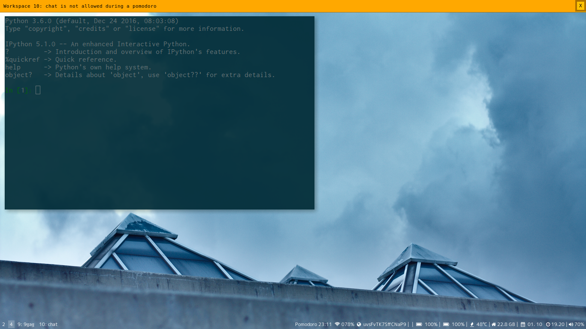

# i3-gnome-pomodoro
Integrate gnome-pomodoro into i3. Support i3bar and polybar.

Here's what i3-gnome-pomodoro looks like on my i3bar:


You can optionally disable certain workspaces during a pomodoro. They are still accessible when you pause a pomodoro.


## About
i3-gnome-pomodoro uses dbus to integrate gnome-pomodoro into i3. Currently it supports the following features:
- View timer status in a terminal, and therefore
- Show timer status on i3bar
- Control pomodoro state in a terminal, and therefore
- Control pomodoro state using bindsym (keyboard and mouse shortcuts)
- *Optionally* suppressing dunst desktop notifications while a pomodoro is active and showing them when the break starts
- *Optionally* disabling specific workspaces (such as instant messaging) while you are on a pomodoro. You can still access those workspaces, if you pause the pomodoro.
- *Optionally* displaying a nagbar warning if you try to access a workspace that you have disabled during your pomodoro.

## Usage and setup
### Dependencies
i3-gnome-pomodoro needs the following Python packages to be installed:
* pygobject
* click
* pydbus
* i3ipc

You can install them using `pip install -r requirements.txt`. Might require `sudo` when installing system-wide. Obviously, you'll also need to have [gnome-pomodoro](http://gnomepomodoro.org/) installed already.
That's it. i3-gnome-pomodoro then should work from the terminal out-of-the-box. But to make it more integrated into i3 and more convenient to use, you might want to set it up with i3bar and put key bindings into your i3 config. So please read along!

I run i3-gnome-pomodoro on Arch Linux with Python 3.6.4, but it should work with other Python 3 binaries as well.

### Terminal
Timer status can be viewed by simply running `python pomodoro-client.py`. Example output:

    $ python pomodoro-client.py status
    Pomodoro 15:35

The timer state can be manipulated using the commands `pause`, `resume`, `start`,
`stop`, `skip`, `toggle` and `reset`. For example:

    $ python pomodoro-client.py pause


### i3bar
Unfortunately, i3status cannot be used to display a custom feature on i3bar. However, another application can use i3status to collect information and combine it with custom features. A very simple way to do that is to create a script in this fashion:
```
#!/usr/bin/env bash

i3status -c ~/.i3/i3status.conf | while :
do
  read line
  pomodoro=`python ~/repos/i3-gnome-pomodoro/pomodoro-client.py status`
  echo "$pomodoro| $line" || exit 1
done
```

After saving that script, make sure you update your i3 config to set it as your `status_command`:
```
bar {
        status_command ~/repos/arch-config/i3status.sh
}
```

And then restart i3 so the changes be in effect right away:

    $ i3-msg restart

If you want to use an i3status replacement, please follow its respective documentation to get information about how you can use i3-gnome-pomodoro.

### polybar

I use the following module in polybar:

```
[module/pomodoro]
type = custom/script
exec = i3-gnome-pomodoro status
interval = 1
```

with the `i3-gnome-pomodoro status --always` flag thing like the block below, becomes possible

```
[module/pomodoro]
type = custom/script
click-left = i3-gnome-pomodoro toggle
click-middle = gnome-pomodoro
click-right = i3-gnome-pomodoro start_stop
exec = i3-gnome-pomodoro status --always
interval = 1

```

### Refresh rate
i3-gnome-pomodoro displays a countdown timer on i3bar. If you use i3status, setting `resfresh_rate` in your i3status configuration can probably result in a better user experience. I personally use this configuration:

```
general {
    interval = 1
}
```

### Keyboard shortcuts
I use the following key bindings in my i3 config:
```
bindsym $mod+F9 exec "python ~/repos/i3-gnome-pomodoro/pomodoro-client.py start"
bindsym $mod+F10 exec "python ~/repos/i3-gnome-pomodoro/pomodoro-client.py toggle"
bindsym $mod+F11 exec "python ~/repos/i3-gnome-pomodoro/pomodoro-client.py skip"
bindsym $mod+F12 exec "python ~/repos/i3-gnome-pomodoro/pomodoro-client.py stop"
```


### Suppressing dunst notifications and disabling workspaces
i3-gnome-pomodoro has a daemon that can suppress dunst notifications while a
pomodoro is active. After your pomodoro is over, dunst still delivers delayed
notifications. To use this daemon, launch it manually when needed or add this
to your i3 configuration to launch it on startup:

```
exec python ~/repos/i3-gnome-pomodoro/pomodoro-client.py daemon &
```

If you want to disable any workspaces during your pomodoro, you can do so by
specifying there workspace number. For example, I generally use workspace 10
for IM, Social Media and Workspace 9 for email. Therefore I want them disabled
while I'm on a pomodoro. So, I execute my daemon like this:

```
exec python ~/repos/i3-gnome-/pomodoro-client.py daemon 9 10 &
```

This works even if you label your workspaces. For example, I use the name "9: mail"
for my email workspace but I still reference it with "9".

I also like to have a nagbar warning shown when I still try to access a distracting workspace:

```
exec python ~/repos/i3-gnome-/pomodoro-client.py daemon 9 10 --nagbar &
```
